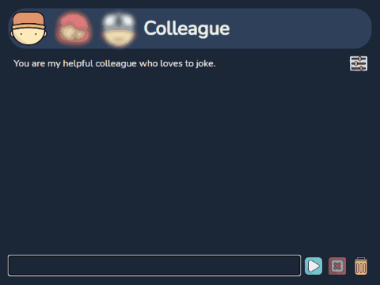

# hot-ai

[OpenAI](https://platform.openai.com/playground) is still 🔥.

[ChatGPT](https://www.codegpt.co/) is very good but I wanted a tiny garage project to learn/experiment with [go](https://go.dev/) + test [wails](https://wails.io/) with an actual project + learn more about [prompting](https://platform.openai.com/docs/introduction/prompts-and-completions).

Update: `go get -u && go mod tidy`
Development: `wails dev`  
Building: `wails build -clean -webview2 embed`

> **Note:** Building flag `-upx` removed! This means bigger binary size but no [false positive antivirus alerts](https://github.com/upx/upx/issues/437).

The [bearicons Outline Color](https://icons8.com/icons/authors/DFlb6Xyr8saR/bearicons/external-bearicons-outline-color-bearicons) icons are from [Icons8](https://icons8.com)

## GPT-4 vs GPT-3.5 Turbo

> **Note:** GPT-4o is `10x` more expensive than GPT-3.5 Turbo! Don't forget to check [pricing](https://openai.com/pricing) and [usage](https://platform.openai.com/account/usage) regularly!

* GPT-4o: *most advanced multimodal model that’s faster and cheaper than GPT-4*
* GPT-4o mini: *most cost-efficient small model that’s smarter and cheaper than GPT-3.5 Turbo* 🔥
* GPT-3.5 Turbo: *fast, expensive model for simple tasks*

| Model          | Input               | Output             |
| -------------- | ------------------- | ------------------ |
| gpt-4o         | $2.50 / 1M tokens   | $10.00 / 1M tokens |
| gpt-4o-mini    | $0.15 / 1M tokens   |  $0.60 / 1M tokens |
| gpt-3.5-turbo  | $3.00 / 1M tokens   |  $8.00 / 1M tokens |

## TODO

 - [ ] Svelte 5 migration  
   This is basically a complete rewrite of the frontend.
   I know there is a [migration script](https://svelte.dev/docs/svelte/v5-migration-guide#Migration-script), but the entire structure needs to be redesigned (store < rune), and it's just not worth it. If there happens to be a development later on that makes it worthwhile to break everything apart, then maybe.
 - [ ] Wails upgrade to v2.9.2  
   In this new version, something is wrong with the focus after the [WindowShow](https://wails.io/docs/reference/runtime/window#windowshow) call. If I have time, I'll look into it and open an issue. However, it's possible that version 3 will be released before I get to it, and it might already be fixed in that version.