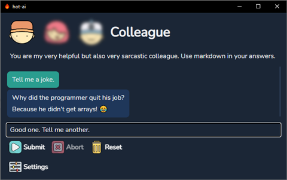

# hot-ai

[OpenAI](https://platform.openai.com/playground) is still 🔥.

[ChatGPT](https://www.codegpt.co/) is very good but I wanted a tiny garage project to learn/experiment with [go](https://go.dev/) + test [wails](https://wails.io/) with an actual project + learn more about [prompting](https://platform.openai.com/docs/introduction/prompts-and-completions).

Development: `wails dev`  
Building: `wails build -clean -webview2 embed`

> **Note:** Building flag `-upx` removed! This means bigger binary size but no [false positive antivirus alerts](https://github.com/upx/upx/issues/437).

Icons: [bearicons Outline Color](https://icons8.com/icons/authors/DFlb6Xyr8saR/bearicons/external-bearicons-outline-color-bearicons) from [Icons8](https://icons8.com)

## GPT-4 vs GPT-3.5 Turbo

> **Note:** GPT-4 costs `20 times more expensive` than GPT-3.5! ... and Turbo is faster as well. Source: [Pricing](https://openai.com/pricing)

| Model          | Context | Input               | Output             |
| -------------- | ------- | ------------------- | ------------------ |
| GPT-4          | 8K      | $0.03 / 1K tokens   | $0.06 / 1K tokens  |
| GPT-4          | 32K     | $0.06 / 1K tokens	 | $0.12 / 1K tokens  |
| GPT-3.5 Turbo  | 4K      | $0.0015 / 1K tokens | $0.002 / 1K tokens |
| GPT-3.5 Turbo  | 16K     | $0.003 / 1K tokens  | $0.004 / 1K tokens |
